# Angular PWA Port — Comprehensive Implementation Plan

> **Status:** For Implementation
> **Created:** 2026-03-21
> **Source:** React Native / Expo ride-sharing app → Angular v21 + Capacitor + PWA
> **Research Sources:** devknowledge MCP (Google developer docs), angular MCP (Angular v21 best practices), context7 MCP (Clerk, Capacitor, Xendit docs)

---

## Table of Contents

1. [Executive Summary](#1-executive-summary)
2. [Phase 0: Project Scaffold](#2-phase-0-project-scaffold)
3. [Phase 1: Design System & Shared Components](#3-phase-1-design-system--shared-components)
4. [Phase 2: Authentication Flow](#4-phase-2-authentication-flow)
5. [Phase 3: Core Services & State](#5-phase-3-core-services--state)
6. [Phase 4: Feature Screens](#6-phase-4-feature-screens)
7. [Phase 5: Backend Extraction](#7-phase-5-backend-extraction)
8. [Phase 6: PWA & Capacitor](#8-phase-6-pwa--capacitor)
9. [File-by-File Migration Map](#9-file-by-file-migration-map)
10. [Dependency Installation Matrix](#10-dependency-installation-matrix)
11. [Environment Configuration](#11-environment-configuration)
12. [Testing Strategy](#12-testing-strategy)
13. [Risk Register](#13-risk-register)

---

## 1. Executive Summary

### What We're Building

A ride-sharing PWA installable on **Windows, Android, iOS, and any platform with a modern browser**. The app is built in **Angular v21** and wrapped with **Capacitor** for native Android builds.

### Target Platforms

| Platform | Delivery Method | Native APIs |
|---|---|---|
| 🪟 **Windows** | PWA via Chrome/Edge "Install app" | GPS via browser |
| 🤖 **Android** | Capacitor APK + Play Store + PWA fallback | Full native (GPS, storage, haptics) |
| 🍎 **iOS** | PWA via Safari "Add to Home Screen" | Limited (no push notifications via PWA) |
| 🐧 **Linux / macOS / ChromeOS** | PWA via browser "Install app" | GPS via browser |

### Tech Stack (from GEMINI.md)

| Layer | Choice | Source |
|---|---|---|
| Framework | Angular v21 (standalone) | angular MCP |
| Auth | `@clerk/clerk-js` web SDK | context7: Clerk docs |
| Payments | Xendit v3 API via Cloud Run | context7: Xendit Node SDK |
| Maps | `@angular/google-maps` + Google Maps JS API | devknowledge |
| Location | `@capacitor/geolocation` (native) + `navigator.geolocation` (web) | context7: Capacitor docs |
| PWA | `@angular/pwa` (service worker + manifest) | devknowledge |
| Backend | Express.js on Cloud Run + Neon Postgres | — |
| Styling | Vanilla CSS design system | angular MCP |

---

## 2. Phase 0: Project Scaffold

> **Goal:** Empty Angular project, configured with correct compiler options, fonts, and tooling.
> **Duration:** ~2 hours

### Step 0.1 — Create Angular Project

```powershell
# Navigate to parent directory
cd C:\PROJECTS

# Create new Angular project (Angular v21 defaults to standalone)
npx -y @angular/cli@latest new uber-angular --style css --ssr false --skip-tests false --routing true

# Or if rewriting in-place inside the existing uber/ directory:
# Back up the RN source first, then scaffold Angular in a temp dir and move files
```

> **Angular MCP guidance:** Angular v21 uses standalone components by default. Do NOT set `standalone: true` — it's implied. Use `signal()`, `computed()`, `input()`, `inject()`, `@if`/`@for` syntax.

### Step 0.2 — Configure `tsconfig.json`

```json
{
  "compilerOptions": {
    "strict": true,
    "target": "ES2022",
    "module": "ES2022",
    "moduleResolution": "bundler",
    "paths": {
      "@core/*": ["src/app/core/*"],
      "@shared/*": ["src/app/shared/*"],
      "@features/*": ["src/app/features/*"],
      "@env": ["src/environments/environment"],
      "@models/*": ["src/app/shared/models/*"]
    }
  }
}
```

### Step 0.3 — Install Plus Jakarta Sans

```html
<!-- index.html -->
<link rel="preconnect" href="https://fonts.googleapis.com">
<link rel="preconnect" href="https://fonts.gstatic.com" crossorigin>
<link href="https://fonts.googleapis.com/css2?family=Plus+Jakarta+Sans:wght@200;300;400;500;600;700;800&display=swap" rel="stylesheet">
```

### Step 0.4 — Create Directory Structure

```powershell
# Core directories
mkdir src/app/core/services
mkdir src/app/core/guards
mkdir src/app/core/interceptors

# Shared
mkdir src/app/shared/components/custom-button
mkdir src/app/shared/components/input-field
mkdir src/app/shared/components/driver-card
mkdir src/app/shared/components/ride-card
mkdir src/app/shared/components/bottom-sheet
mkdir src/app/shared/components/google-text-input
mkdir src/app/shared/components/map
mkdir src/app/shared/models

# Features
mkdir src/app/features/auth/welcome
mkdir src/app/features/auth/sign-in
mkdir src/app/features/auth/sign-up
mkdir src/app/features/auth/oauth
mkdir src/app/features/home
mkdir src/app/features/rides
mkdir src/app/features/chat
mkdir src/app/features/profile
mkdir src/app/features/ride-flow/find-ride
mkdir src/app/features/ride-flow/confirm-ride
mkdir src/app/features/ride-flow/book-ride

# Layout
mkdir src/app/layout/tab-layout
mkdir src/app/layout/ride-layout

# Assets (copy from original RN project)
# Copy assets/images/* and assets/icons/* from the Expo project
```

### Step 0.5 — Checkpoint

- [ ] `ng serve` runs successfully
- [ ] Plus Jakarta Sans renders in browser
- [ ] Directory structure matches GEMINI.md blueprint
- [ ] All path aliases resolve

---

## 3. Phase 1: Design System & Shared Components

> **Goal:** Global CSS design system + all reusable shared components.
> **Duration:** ~1 day
> **Prerequisite:** Phase 0 complete

### Step 1.1 — Global Design System (`styles.css`)

Port NativeWind utility classes to CSS custom properties:

```css
/* styles.css — Global Design System */

:root {
  /* ── Brand Colors ── */
  --color-primary: #0286FF;
  --color-primary-hover: #0170d6;
  --color-secondary: #333333;
  --color-success: #0CC25F;
  --color-danger: #F44336;
  --color-warning: #FF9800;

  /* ── Neutral Palette ── */
  --color-general-100: #CED1DD;
  --color-general-200: #858585;
  --color-general-300: #EEEEEE;
  --color-general-400: #0CC25F;
  --color-general-500: #F6F8FA;
  --color-general-600: #E2E8F0;
  --color-general-700: #D6D6D6;
  --color-general-800: #AFAFAF;

  /* ── Typography ── */
  --font-family: 'Plus Jakarta Sans', sans-serif;
  --font-size-xs: 0.75rem;
  --font-size-sm: 0.875rem;
  --font-size-base: 1rem;
  --font-size-lg: 1.125rem;
  --font-size-xl: 1.25rem;
  --font-size-2xl: 1.5rem;
  --font-size-3xl: 1.875rem;

  /* ── Spacing ── */
  --spacing-xs: 0.25rem;
  --spacing-sm: 0.5rem;
  --spacing-md: 1rem;
  --spacing-lg: 1.5rem;
  --spacing-xl: 2rem;
  --spacing-2xl: 3rem;

  /* ── Radii ── */
  --radius-sm: 0.375rem;
  --radius-md: 0.625rem;
  --radius-lg: 1rem;
  --radius-full: 9999px;

  /* ── Shadows ── */
  --shadow-sm: 0 1px 2px rgba(0,0,0,0.05);
  --shadow-md: 0 4px 6px rgba(0,0,0,0.1);
  --shadow-lg: 0 10px 15px rgba(0,0,0,0.15);

  /* ── Tab Bar ── */
  --tab-bar-height: 78px;
  --tab-bar-bg: #333333;
  --tab-bar-radius: 50px;
}

* { box-sizing: border-box; margin: 0; padding: 0; }

html, body {
  height: 100%;
  font-family: var(--font-family);
  -webkit-font-smoothing: antialiased;
  background: var(--color-general-500);
}
```

### Step 1.2 — Shared Components

Each component maps 1:1 from the original RN codebase:

| RN Component | Angular Component | Key Inputs | Notes |
|---|---|---|---|
| `CustomButton.tsx` | `custom-button/` | `title`, `bgVariant`, `textVariant`, `iconLeft`, `iconRight` | Use `input()` function |
| `InputField.tsx` | `input-field/` | `label`, `icon`, `placeholder`, `secureTextEntry` | Use reactive forms |
| `DriverCard.tsx` | `driver-card/` | `driver`, `selected` | `output()` for selection |
| `RideCard.tsx` | `ride-card/` | `ride` | Static Geoapify map image |
| `RideLayout.tsx` | `ride-layout/` | `title`, `snapPoints` | Contains MapComponent + BottomSheet |
| `GoogleTextInput.tsx` | `google-text-input/` | `icon`, `containerStyle` | `output()` emits selected location |
| `Map.tsx` | `map/` | — | Uses `@angular/google-maps` |

#### Example: CustomButton (Angular v21 pattern)

```typescript
// shared/components/custom-button/custom-button.component.ts
import { Component, ChangeDetectionStrategy, input, output } from '@angular/core';

@Component({
  selector: 'app-custom-button',
  template: `
    <button
      [class]="'btn btn--' + bgVariant()"
      [disabled]="disabled()"
      (click)="pressed.emit()">
      @if (iconLeft()) {
        
      }
      <span [class]="'btn__text btn__text--' + textVariant()">
        {{ title() }}
      </span>
      @if (iconRight()) {
        
      }
    </button>
  `,
  styleUrl: './custom-button.component.css',
  changeDetection: ChangeDetectionStrategy.OnPush,
})
export class CustomButtonComponent {
  readonly title = input.required<string>();
  readonly bgVariant = input<'primary' | 'secondary' | 'danger' | 'outline' | 'success'>('primary');
  readonly textVariant = input<'default' | 'primary' | 'secondary' | 'danger' | 'success'>('default');
  readonly iconLeft = input<string | null>(null);
  readonly iconRight = input<string | null>(null);
  readonly disabled = input<boolean>(false);
  readonly pressed = output<void>();
}
```

### Step 1.3 — Checkpoint

- [ ] All 7 shared components compile
- [ ] Components use `input()`, `output()`, `OnPush`
- [ ] No `@Input()`, `@Output()`, `*ngIf`, `*ngFor` used
- [ ] Visual appearance matches original app

---

## 4. Phase 2: Authentication Flow

> **Goal:** Clerk JS SDK integration with sign-in, sign-up, OTP verification, and Google OAuth.
> **Duration:** ~1.5 days
> **Prerequisite:** Phase 1 complete
> **Research source:** context7 — Clerk docs (`/clerk/clerk-docs`)

### Step 2.1 — Install Clerk JS SDK

```powershell
npm install @clerk/clerk-js
```

> **Important (from context7 research):** Clerk's JS SDK provides `Clerk`, `SignIn`, and `SignUp` objects. There is no official Angular SDK — we wrap the vanilla JS SDK in an Angular service. The SDK API uses:
> - `signIn.password({ emailAddress, password })` for email/password sign-in
> - `signUp.password({ emailAddress, password })` for registration
> - `signUp.verifications.sendEmailCode()` to send OTP
> - `signUp.verifications.verifyEmailCode({ code })` to verify OTP
> - `signUp.finalize()` / `signIn.finalize()` to set the active session

### Step 2.2 — AuthService

```typescript
// core/services/auth.service.ts
import { Injectable, signal, computed } from '@angular/core';
import Clerk from '@clerk/clerk-js';
import { environment } from '@env';

@Injectable({ providedIn: 'root' })
export class AuthService {
  private clerk!: Clerk;

  readonly user = signal<any>(null);
  readonly isLoading = signal(true);
  readonly isAuthenticated = computed(() => !!this.user());

  async initialize(): Promise<void> {
    this.clerk = new Clerk(environment.clerkPublishableKey);
    await this.clerk.load();

    // Listen for session changes
    this.clerk.addListener((resources) => {
      this.user.set(resources.user ?? null);
      this.isLoading.set(false);
    });
  }

  get clerkInstance(): Clerk { return this.clerk; }

  async signInWithEmail(email: string, password: string) {
    const signIn = this.clerk.client!.signIn;
    return signIn.password({ emailAddress: email, password });
  }

  async signUpWithEmail(email: string, password: string) {
    const signUp = this.clerk.client!.signUp;
    const result = await signUp.password({ emailAddress: email, password });
    if (!result.error) {
      await signUp.verifications.sendEmailCode();
    }
    return result;
  }

  async verifyEmailOTP(code: string) {
    const signUp = this.clerk.client!.signUp;
    await signUp.verifications.verifyEmailCode({ code });
    if (signUp.status === 'complete') {
      await signUp.finalize({
        navigate: ({ decorateUrl }) => {
          window.location.href = decorateUrl('/app/home');
        }
      });
    }
  }

  async signOut(): Promise<void> {
    await this.clerk.signOut();
    this.user.set(null);
  }

  async getToken(): Promise<string | null> {
    const session = this.clerk.session;
    return session ? await session.getToken() : null;
  }
}
```

### Step 2.3 — AuthGuard (Functional)

```typescript
// core/guards/auth.guard.ts
import { inject } from '@angular/core';
import { Router, type CanActivateFn } from '@angular/router';
import { AuthService } from '@core/services/auth.service';

export const authGuard: CanActivateFn = () => {
  const auth = inject(AuthService);
  const router = inject(Router);

  if (auth.isAuthenticated()) return true;
  router.navigate(['/auth/welcome']);
  return false;
};
```

> **Angular MCP guidance:** Use functional `CanActivateFn` guards, NOT class-based guards. Use `inject()` inside the function body.

### Step 2.4 — Auth Screens

| Screen | Source File | Angular Component | Key Clerk API |
|---|---|---|---|
| Welcome | `app/(auth)/welcome.tsx` | `features/auth/welcome/` | None (navigation only) |
| Sign In | `app/(auth)/sign-in.tsx` | `features/auth/sign-in/` | `signIn.password()` |
| Sign Up | `app/(auth)/sign-up.tsx` | `features/auth/sign-up/` | `signUp.password()` + `verifyEmailCode()` |
| OAuth | `components/OAuth.tsx` | `features/auth/oauth/` | `clerk.client.signIn.authenticateWithRedirect()` |

### Step 2.5 — Initialize Clerk in app.config.ts

```typescript
// app.config.ts
import { APP_INITIALIZER, ApplicationConfig } from '@angular/core';
import { provideRouter } from '@angular/router';
import { provideHttpClient, withInterceptors } from '@angular/common/http';
import { routes } from './app.routes';
import { AuthService } from '@core/services/auth.service';

function initializeClerk(auth: AuthService) {
  return () => auth.initialize();
}

export const appConfig: ApplicationConfig = {
  providers: [
    provideRouter(routes),
    provideHttpClient(withInterceptors([authInterceptor])),
    {
      provide: APP_INITIALIZER,
      useFactory: initializeClerk,
      deps: [AuthService],
      multi: true,
    },
  ],
};
```

### Step 2.6 — Checkpoint

- [ ] Clerk initializes on app start
- [ ] Sign-up → OTP → verified → session created
- [ ] Sign-in with email/password works
- [ ] Google OAuth redirect + callback works
- [ ] AuthGuard correctly redirects unauthenticated users
- [ ] `auth.user()` signal updates across components

---

## 5. Phase 3: Core Services & State

> **Goal:** All singleton services with signal-based state. Replace Zustand stores.
> **Duration:** ~1.5 days
> **Prerequisite:** Phase 2 complete

### Step 3.1 — LocationService (replaces `useLocationStore`)

```typescript
// core/services/location.service.ts
import { Injectable, signal, computed } from '@angular/core';
import { Geolocation } from '@capacitor/geolocation';

@Injectable({ providedIn: 'root' })
export class LocationService {
  readonly userLatitude = signal<number | null>(null);
  readonly userLongitude = signal<number | null>(null);
  readonly userAddress = signal<string | null>(null);
  readonly destinationLatitude = signal<number | null>(null);
  readonly destinationLongitude = signal<number | null>(null);
  readonly destinationAddress = signal<string | null>(null);

  readonly hasDestination = computed(() =>
    this.destinationLatitude() !== null && this.destinationLongitude() !== null
  );

  setUserLocation(loc: { latitude: number; longitude: number; address: string }) {
    this.userLatitude.set(loc.latitude);
    this.userLongitude.set(loc.longitude);
    this.userAddress.set(loc.address);
  }

  setDestinationLocation(loc: { latitude: number; longitude: number; address: string }) {
    this.destinationLatitude.set(loc.latitude);
    this.destinationLongitude.set(loc.longitude);
    this.destinationAddress.set(loc.address);
  }

  clearDestination() {
    this.destinationLatitude.set(null);
    this.destinationLongitude.set(null);
    this.destinationAddress.set(null);
  }

  async requestCurrentLocation(): Promise<void> {
    try {
      const permission = await Geolocation.requestPermissions();
      if (permission.location === 'granted') {
        const position = await Geolocation.getCurrentPosition();
        // Reverse geocode using Google Maps Geocoder
        const geocoder = new google.maps.Geocoder();
        const result = await geocoder.geocode({
          location: { lat: position.coords.latitude, lng: position.coords.longitude }
        });
        this.setUserLocation({
          latitude: position.coords.latitude,
          longitude: position.coords.longitude,
          address: result.results[0]?.formatted_address ?? 'Unknown location',
        });
      }
    } catch (e) {
      console.error('Location error:', e);
      // Fallback to browser API
      navigator.geolocation.getCurrentPosition((pos) => {
        this.setUserLocation({
          latitude: pos.coords.latitude,
          longitude: pos.coords.longitude,
          address: 'Current location',
        });
      });
    }
  }
}
```

> **Capacitor docs (context7):** Use `Geolocation.requestPermissions()` first, then `Geolocation.getCurrentPosition()`. On Android, requires `ACCESS_FINE_LOCATION` + `ACCESS_COARSE_LOCATION` in `AndroidManifest.xml`.

### Step 3.2 — DriverService (replaces `useDriverStore`)

```typescript
// core/services/driver.service.ts
import { Injectable, inject, signal } from '@angular/core';
import { HttpClient } from '@angular/common/http';
import { environment } from '@env';
import type { Driver, MarkerData } from '@models/driver.model';

@Injectable({ providedIn: 'root' })
export class DriverService {
  private readonly http = inject(HttpClient);

  readonly drivers = signal<MarkerData[]>([]);
  readonly selectedDriver = signal<number | null>(null);
  readonly driverTimes = signal<Record<number, { time: number; price: string }>>({});

  async loadDrivers(): Promise<void> {
    const resp = await this.http
      .get<{ data: Driver[] }>(`${environment.apiUrl}/api/drivers`)
      .toPromise();
    if (resp?.data) {
      this.drivers.set(resp.data.map(d => ({
        latitude: d.latitude ?? 0,
        longitude: d.longitude ?? 0,
        id: d.id,
        title: `${d.first_name} ${d.last_name}`,
        ...d,
      })));
    }
  }

  selectDriver(id: number): void { this.selectedDriver.set(id); }
  clearSelection(): void { this.selectedDriver.set(null); }
}
```

### Step 3.3 — RideService

```typescript
// core/services/ride.service.ts
import { Injectable, inject, signal } from '@angular/core';
import { HttpClient } from '@angular/common/http';
import { environment } from '@env';
import type { Ride } from '@models/ride.model';

@Injectable({ providedIn: 'root' })
export class RideService {
  private readonly http = inject(HttpClient);

  readonly recentRides = signal<Ride[]>([]);
  readonly isLoading = signal(false);

  async loadRides(userId: string): Promise<void> {
    this.isLoading.set(true);
    try {
      const resp = await this.http
        .get<{ data: Ride[] }>(`${environment.apiUrl}/api/rides/${userId}`)
        .toPromise();
      this.recentRides.set(resp?.data ?? []);
    } finally {
      this.isLoading.set(false);
    }
  }

  async createRide(rideData: Omit<Ride, 'ride_id' | 'created_at' | 'driver'>): Promise<Ride> {
    const resp = await this.http
      .post<{ data: Ride }>(`${environment.apiUrl}/api/rides`, rideData)
      .toPromise();
    return resp!.data;
  }
}
```

### Step 3.4 — PaymentService (Xendit)

```typescript
// core/services/payment.service.ts
import { Injectable, inject, signal } from '@angular/core';
import { HttpClient, HttpHeaders } from '@angular/common/http';
import { AuthService } from './auth.service';
import { environment } from '@env';

@Injectable({ providedIn: 'root' })
export class PaymentService {
  private readonly http = inject(HttpClient);
  private readonly auth = inject(AuthService);

  readonly paymentStatus = signal<'idle' | 'pending' | 'paid' | 'failed'>('idle');
  readonly isProcessing = signal(false);

  /** Create a Xendit payment for a ride fare */
  async payForRide(rideId: number, fareAmount: number): Promise<string> {
    this.isProcessing.set(true);
    this.paymentStatus.set('pending');

    const token = await this.auth.getToken();
    const headers = new HttpHeaders({ Authorization: `Bearer ${token}` });

    const resp = await this.http.post<{ redirect_url: string; reference_id: string }>(
      `${environment.apiUrl}/api/payments/create`,
      { ride_id: rideId, fare_amount: fareAmount },
      { headers }
    ).toPromise();

    if (!resp?.redirect_url) throw new Error('No checkout URL');

    // Open Xendit checkout — on Capacitor use Browser plugin, on web use window.open
    window.open(resp.redirect_url, '_blank');

    return resp.reference_id;
  }

  /** Poll for payment confirmation */
  async confirmPayment(referenceId: string): Promise<void> {
    const token = await this.auth.getToken();
    const headers = new HttpHeaders({ Authorization: `Bearer ${token}` });

    for (let i = 0; i < 10; i++) {
      await new Promise(r => setTimeout(r, 3000)); // Wait 3s between polls
      const resp = await this.http.post<{ status: string }>(
        `${environment.apiUrl}/api/payments/confirm`,
        { reference_id: referenceId },
        { headers }
      ).toPromise();

      if (resp?.status === 'paid' || resp?.status === 'credited') {
        this.paymentStatus.set('paid');
        this.isProcessing.set(false);
        return;
      }
    }
    // After 10 attempts, mark as pending (webhook will handle)
    this.isProcessing.set(false);
  }
}
```

> **Xendit Node SDK (context7):** The backend uses `POST /v3/payment_requests` with `channel_code: "GCASH"`, `country: "PH"`, `currency: "PHP"`. The response has `actions[0].value` which is the checkout URL.

### Step 3.5 — MapService

```typescript
// core/services/map.service.ts
import { Injectable, inject, computed } from '@angular/core';
import { LocationService } from './location.service';
import { DriverService } from './driver.service';

@Injectable({ providedIn: 'root' })
export class MapService {
  private readonly location = inject(LocationService);
  private readonly driver = inject(DriverService);

  /** Computed map region based on user + destination */
  readonly region = computed(() => {
    const lat = this.location.userLatitude();
    const lng = this.location.userLongitude();
    if (!lat || !lng) return { center: { lat: 14.5995, lng: 120.9842 }, zoom: 14 };

    const dLat = this.location.destinationLatitude();
    const dLng = this.location.destinationLongitude();
    if (dLat && dLng) {
      return {
        center: { lat: (lat + dLat) / 2, lng: (lng + dLng) / 2 },
        zoom: 12,
      };
    }
    return { center: { lat, lng }, zoom: 15 };
  });

  /** All markers: user + drivers */
  readonly markers = computed(() => {
    const result: google.maps.LatLngLiteral[] = [];
    const lat = this.location.userLatitude();
    const lng = this.location.userLongitude();
    if (lat && lng) result.push({ lat, lng });
    return result;
  });
}
```

### Step 3.6 — Checkpoint

- [ ] All 6 services instantiated and `providedIn: 'root'`
- [ ] LocationService can get GPS position
- [ ] DriverService fetches from API
- [ ] PaymentService opens Xendit checkout
- [ ] MapService computes region from location signals
- [ ] All state is signal-based — no RxJS `BehaviorSubject` for state

---

## 6. Phase 4: Feature Screens

> **Goal:** All 10 application screens implemented.
> **Duration:** ~3 days
> **Prerequisite:** Phase 3 complete

### Step 4.1 — App Routing (`app.routes.ts`)

```typescript
import { Routes } from '@angular/router';
import { authGuard } from '@core/guards/auth.guard';

export const routes: Routes = [
  { path: '', redirectTo: 'auth/welcome', pathMatch: 'full' },

  // Auth routes (unguarded)
  {
    path: 'auth',
    children: [
      { path: 'welcome', loadComponent: () => import('./features/auth/welcome/welcome.component') },
      { path: 'sign-in', loadComponent: () => import('./features/auth/sign-in/sign-in.component') },
      { path: 'sign-up', loadComponent: () => import('./features/auth/sign-up/sign-up.component') },
    ]
  },

  // App routes (guarded)
  {
    path: 'app',
    canActivate: [authGuard],
    children: [
      {
        path: '',
        loadComponent: () => import('./layout/tab-layout/tab-layout.component'),
        children: [
          { path: 'home', loadComponent: () => import('./features/home/home.component') },
          { path: 'rides', loadComponent: () => import('./features/rides/rides.component') },
          { path: 'chat', loadComponent: () => import('./features/chat/chat.component') },
          { path: 'profile', loadComponent: () => import('./features/profile/profile.component') },
          { path: '', redirectTo: 'home', pathMatch: 'full' },
        ]
      },
      { path: 'find-ride', loadComponent: () => import('./features/ride-flow/find-ride/find-ride.component') },
      { path: 'confirm-ride', loadComponent: () => import('./features/ride-flow/confirm-ride/confirm-ride.component') },
      { path: 'book-ride', loadComponent: () => import('./features/ride-flow/book-ride/book-ride.component') },
    ]
  },

  { path: '**', redirectTo: 'auth/welcome' }
];
```

### Step 4.2 — Screen Implementation Matrix

| Screen | RN Source | Angular Component | Input Signals | Injected Services | Critical |
|---|---|---|---|---|---|
| Welcome | `welcome.tsx` | `features/auth/welcome/` | — | Router | ⬜ |
| Sign In | `sign-in.tsx` | `features/auth/sign-in/` | — | AuthService, Router | 🟡 |
| Sign Up | `sign-up.tsx` | `features/auth/sign-up/` | — | AuthService, Router | 🟡 |
| Home | `home.tsx` | `features/home/` | — | AuthService, LocationService, RideService | 🔴 |
| Rides | `rides.tsx` | `features/rides/` | — | RideService, AuthService | 🟡 |
| Chat | `chat.tsx` | `features/chat/` | — | — (placeholder) | ⬜ |
| Profile | `profile.tsx` | `features/profile/` | — | AuthService | ⬜ |
| Find Ride | `find-ride.tsx` | `features/ride-flow/find-ride/` | — | LocationService | 🟡 |
| Confirm Ride | `confirm-ride.tsx` | `features/ride-flow/confirm-ride/` | — | DriverService, LocationService | 🟡 |
| Book Ride | `book-ride.tsx` | `features/ride-flow/book-ride/` | — | DriverService, PaymentService, RideService | 🔴 |

### Step 4.3 — Google Maps Integration

```powershell
npm install @angular/google-maps
```

**Load the Maps JS API via `index.html`:**
```html
<script src="https://maps.googleapis.com/maps/api/js?key=YOUR_KEY&libraries=places,directions&loading=async" async defer></script>
```

**MapComponent implementation:**
```typescript
// shared/components/map/map.component.ts
import { Component, ChangeDetectionStrategy, inject, effect } from '@angular/core';
import { GoogleMap, MapMarker, MapDirectionsRenderer } from '@angular/google-maps';
import { LocationService } from '@core/services/location.service';
import { DriverService } from '@core/services/driver.service';
import { MapService } from '@core/services/map.service';

@Component({
  selector: 'app-map',
  imports: [GoogleMap, MapMarker, MapDirectionsRenderer],
  template: `
    <google-map
      [center]="mapService.region().center"
      [zoom]="mapService.region().zoom"
      width="100%"
      height="100%">

      @if (location.userLatitude() && location.userLongitude()) {
        <map-marker
          [position]="{ lat: location.userLatitude()!, lng: location.userLongitude()! }"
          [options]="{ icon: { url: 'assets/icons/pin.png', scaledSize: markerSize } }" />
      }

      @for (driver of driverService.drivers(); track driver.id) {
        <map-marker
          [position]="{ lat: driver.latitude, lng: driver.longitude }"
          [title]="driver.title" />
      }

      @if (directionsResult) {
        <map-directions-renderer [directions]="directionsResult" />
      }
    </google-map>
  `,
  changeDetection: ChangeDetectionStrategy.OnPush,
  host: { class: 'map-container' }
})
export default class MapComponent {
  readonly location = inject(LocationService);
  readonly driverService = inject(DriverService);
  readonly mapService = inject(MapService);

  directionsResult: google.maps.DirectionsResult | null = null;
  markerSize = new google.maps.Size(40, 40);

  constructor() {
    // React to destination changes
    effect(() => {
      const dLat = this.location.destinationLatitude();
      const dLng = this.location.destinationLongitude();
      const uLat = this.location.userLatitude();
      const uLng = this.location.userLongitude();
      if (dLat && dLng && uLat && uLng) {
        this.calculateRoute(
          { lat: uLat, lng: uLng },
          { lat: dLat, lng: dLng }
        );
      }
    });
  }

  private calculateRoute(origin: google.maps.LatLngLiteral, destination: google.maps.LatLngLiteral) {
    const directionsService = new google.maps.DirectionsService();
    directionsService.route({
      origin,
      destination,
      travelMode: google.maps.TravelMode.DRIVING,
    }).then(result => {
      this.directionsResult = result;
    });
  }
}
```

> **devknowledge research:** Google Maps JS API with `DirectionsService.route()` returns `DirectionsResult` containing route polylines. The `@angular/google-maps` package provides `<google-map>`, `<map-marker>`, and `<map-directions-renderer>` components.

### Step 4.4 — Tab Layout

```typescript
// layout/tab-layout/tab-layout.component.ts
import { Component, ChangeDetectionStrategy } from '@angular/core';
import { RouterOutlet, RouterLink, RouterLinkActive } from '@angular/router';

@Component({
  selector: 'app-tab-layout',
  imports: [RouterOutlet, RouterLink, RouterLinkActive],
  template: `
    <div class="tab-content">
      <router-outlet />
    </div>
    <nav class="tab-bar" role="navigation" aria-label="Main navigation">
      <a routerLink="/app/home" routerLinkActive="tab--active" class="tab" aria-label="Home">
        
      </a>
      <a routerLink="/app/rides" routerLinkActive="tab--active" class="tab" aria-label="Rides">
        
      </a>
      <a routerLink="/app/chat" routerLinkActive="tab--active" class="tab" aria-label="Chat">
        
      </a>
      <a routerLink="/app/profile" routerLinkActive="tab--active" class="tab" aria-label="Profile">
        
      </a>
    </nav>
  `,
  styleUrl: './tab-layout.component.css',
  changeDetection: ChangeDetectionStrategy.OnPush,
})
export default class TabLayoutComponent {}
```

### Step 4.5 — Checkpoint

- [ ] All 10 screens render
- [ ] Tab navigation works (Home, Rides, Chat, Profile)
- [ ] Ride flow navigation: Home → Find → Confirm → Book
- [ ] Map renders with user location + driver markers
- [ ] Google Places autocomplete works in GoogleTextInput
- [ ] Directions display between origin and destination

---

## 7. Phase 5: Backend Extraction

> **Goal:** Extract Expo API routes into a standalone Express.js backend on Cloud Run.
> **Duration:** ~1 day
> **Prerequisite:** Phase 4 complete

### Step 5.1 — Create Backend Project

```
cloud-run/
├── main.js           # Express.js server
├── package.json
├── Dockerfile
└── .env.example
```

### Step 5.2 — Endpoint Implementation

Port all 6 Expo API routes:

| Original | Express Endpoint | SQL Query |
|---|---|---|
| `(api)/user+api.ts` | `POST /api/users` | `INSERT INTO users (name, email, clerk_id)` |
| `(api)/driver+api.ts` | `GET /api/drivers` | `SELECT * FROM drivers` |
| `(api)/ride/create+api.ts` | `POST /api/rides` | `INSERT INTO rides (...)` |
| `(api)/ride/[id]+api.ts` | `GET /api/rides/:userId` | `SELECT rides.*, driver JSON FROM rides JOIN drivers` |

Plus 3 new Xendit endpoints (modeled on robsky-angular's `main.py`):

| Endpoint | Purpose | Xendit API |
|---|---|---|
| `POST /api/payments/create` | Create payment request | `POST /v3/payment_requests` |
| `POST /api/payments/confirm` | Poll payment status | `GET /v3/payment_requests/{id}` |
| `POST /api/webhooks/xendit` | Fulfill on success | Validates `x-callback-token` |

```javascript
// cloud-run/main.js — Express.js backend skeleton
const express = require('express');
const cors = require('cors');
const { neon } = require('@neondatabase/serverless');

const app = express();
app.use(cors());
app.use(express.json());

const sql = neon(process.env.DATABASE_URL);

// GET /api/drivers
app.get('/api/drivers', async (req, res) => {
  try {
    const drivers = await sql`SELECT * FROM drivers`;
    res.json({ data: drivers });
  } catch (e) {
    res.status(500).json({ error: 'Internal Server Error' });
  }
});

// POST /api/rides
app.post('/api/rides', async (req, res) => {
  const { origin_address, destination_address, origin_latitude, origin_longitude,
          destination_latitude, destination_longitude, ride_time, fare_price,
          payment_status, driver_id, user_id } = req.body;
  // ... validation + INSERT INTO rides
});

// POST /api/payments/create — Xendit v3
app.post('/api/payments/create', async (req, res) => {
  const { ride_id, fare_amount } = req.body;
  // 1. Validate auth token
  // 2. Call Xendit POST /v3/payment_requests
  // 3. Return { redirect_url, reference_id }
});

const PORT = process.env.PORT || 8080;
app.listen(PORT, () => console.log(`Server running on port ${PORT}`));
```

### Step 5.3 — Deploy to Cloud Run

```powershell
# Build and deploy
gcloud run deploy ryde-api \
  --source ./cloud-run \
  --region asia-southeast1 \
  --allow-unauthenticated \
  --set-env-vars "DATABASE_URL=$DATABASE_URL,XENDIT_SECRET_KEY=$XENDIT_SECRET_KEY,XENDIT_CALLBACK_TOKEN=$XENDIT_CALLBACK_TOKEN"
```

### Step 5.4 — Checkpoint

- [ ] All 7 API endpoints respond correctly
- [ ] Neon Postgres queries work from Cloud Run
- [ ] Xendit payment creation returns checkout URL
- [ ] Webhook endpoint verifies `x-callback-token`
- [ ] CORS configured for Angular dev + production origins

---

## 8. Phase 6: PWA & Capacitor

> **Goal:** Make the app installable on all platforms.
> **Duration:** ~1 day
> **Prerequisite:** Phase 5 complete
> **Research source:** devknowledge — Angular PWA docs

### Step 6.1 — Add Angular PWA

```powershell
ng add @angular/pwa
```

> **devknowledge research:** This command auto-generates:
> - Service worker with default caching config (`ngsw-config.json`)
> - Web app manifest (`manifest.webmanifest`)
> - Manifest link + theme-color meta in `index.html`
> - App icons in `src/assets/icons/`

### Step 6.2 — Customize Manifest

```json
{
  "name": "Ryde - Ride Sharing",
  "short_name": "Ryde",
  "theme_color": "#0286FF",
  "background_color": "#ffffff",
  "display": "standalone",
  "scope": "/",
  "start_url": "/app/home",
  "orientation": "portrait",
  "icons": [
    { "src": "assets/icons/icon-192x192.png", "sizes": "192x192", "type": "image/png", "purpose": "any maskable" },
    { "src": "assets/icons/icon-512x512.png", "sizes": "512x512", "type": "image/png", "purpose": "any maskable" }
  ]
}
```

### Step 6.3 — Configure Service Worker Caching

```json
{
  "$schema": "./node_modules/@angular/service-worker/config/schema.json",
  "index": "/index.html",
  "assetGroups": [
    {
      "name": "app",
      "installMode": "prefetch",
      "resources": {
        "files": ["/favicon.ico", "/index.html", "/*.css", "/*.js"]
      }
    },
    {
      "name": "assets",
      "installMode": "lazy",
      "updateMode": "prefetch",
      "resources": {
        "files": ["/assets/**", "/*.(svg|cur|jpg|jpeg|png|apng|webp|avif|gif|otf|ttf|woff|woff2)"]
      }
    }
  ],
  "dataGroups": [
    {
      "name": "api-drivers",
      "urls": ["/api/drivers"],
      "cacheConfig": {
        "maxSize": 1,
        "maxAge": "1h",
        "strategy": "freshness",
        "timeout": "5s"
      }
    }
  ]
}
```

### Step 6.4 — Add Capacitor

```powershell
# Install Capacitor
npm install @capacitor/core
npm install -D @capacitor/cli

# Initialize
npx cap init "Ryde" "com.ryde.app" --web-dir dist/ryde/browser

# Add Android platform
npm install @capacitor/android
npx cap add android

# Install plugins
npm install @capacitor/geolocation @capacitor/preferences @capacitor/splash-screen @capacitor/status-bar @capacitor/browser @capacitor/app @capacitor/haptics
npx cap sync
```

### Step 6.5 — Platform-specific Geolocation Abstraction

```typescript
// core/services/platform.service.ts
import { Injectable } from '@angular/core';
import { Capacitor } from '@capacitor/core';

@Injectable({ providedIn: 'root' })
export class PlatformService {
  readonly isNative = Capacitor.isNativePlatform();
  readonly platform = Capacitor.getPlatform(); // 'web' | 'android' | 'ios'
}
```

### Step 6.6 — Build & Test PWA

```powershell
# Build production bundle
ng build --configuration production

# Test PWA locally (service worker only works over HTTPS or localhost)
npx http-server dist/ryde/browser -p 8080

# Verify installability in Chrome DevTools > Application > Manifest
```

### Step 6.7 — Build & Test Android

```powershell
# Build Angular + sync to Capacitor
ng build --configuration production
npx cap sync android

# Open in Android Studio
npx cap open android

# Or run directly (requires Android SDK + device/emulator)
npx cap run android
```

### Step 6.8 — Generate Icons & Splash Screens

```powershell
npm install -D @capacitor/assets

# Requires source images in assets/ folder:
# - assets/icon-only.png (1024x1024, no transparency)
# - assets/icon-foreground.png (1024x1024, for adaptive)
# - assets/icon-background.png (1024x1024)
# - assets/splash.png (2732x2732)
# - assets/splash-dark.png (2732x2732, optional)

npx capacitor-assets generate
```

### Step 6.9 — Checkpoint

- [ ] PWA installable on Chrome desktop ("Install Ryde" prompt appears)
- [ ] PWA installable on Android Chrome
- [ ] PWA installable on iOS Safari
- [ ] Service worker caches app shell for offline start
- [ ] Capacitor Android APK runs on emulator
- [ ] Geolocation works on both web and native
- [ ] App icons + splash screen display correctly

---

## 9. File-by-File Migration Map

Complete mapping from every React Native source file to its Angular equivalent:

### Components

| RN Source | → Angular Target | Status |
|---|---|---|
| `components/CustomButton.tsx` | `shared/components/custom-button/custom-button.component.ts` | Phase 1 |
| `components/InputField.tsx` | `shared/components/input-field/input-field.component.ts` | Phase 1 |
| `components/DriverCard.tsx` | `shared/components/driver-card/driver-card.component.ts` | Phase 1 |
| `components/RideCard.tsx` | `shared/components/ride-card/ride-card.component.ts` | Phase 1 |
| `components/RideLayout.tsx` | `layout/ride-layout/ride-layout.component.ts` | Phase 1 |
| `components/GoogleTextInput.tsx` | `shared/components/google-text-input/google-text-input.component.ts` | Phase 1 |
| `components/Map.tsx` | `shared/components/map/map.component.ts` | Phase 4 |
| `components/Payment.tsx` | Integrated into `BookRideComponent` + `PaymentService` | Phase 4 |
| `components/OAuth.tsx` | `features/auth/oauth/oauth.component.ts` | Phase 2 |

### Screens

| RN Source | → Angular Target | Status |
|---|---|---|
| `app/(auth)/welcome.tsx` | `features/auth/welcome/welcome.component.ts` | Phase 2 |
| `app/(auth)/sign-in.tsx` | `features/auth/sign-in/sign-in.component.ts` | Phase 2 |
| `app/(auth)/sign-up.tsx` | `features/auth/sign-up/sign-up.component.ts` | Phase 2 |
| `app/(root)/(tabs)/home.tsx` | `features/home/home.component.ts` | Phase 4 |
| `app/(root)/(tabs)/rides.tsx` | `features/rides/rides.component.ts` | Phase 4 |
| `app/(root)/(tabs)/chat.tsx` | `features/chat/chat.component.ts` | Phase 4 |
| `app/(root)/(tabs)/profile.tsx` | `features/profile/profile.component.ts` | Phase 4 |
| `app/(root)/(tabs)/_layout.tsx` | `layout/tab-layout/tab-layout.component.ts` | Phase 4 |
| `app/(root)/find-ride.tsx` | `features/ride-flow/find-ride/find-ride.component.ts` | Phase 4 |
| `app/(root)/confirm-ride.tsx` | `features/ride-flow/confirm-ride/confirm-ride.component.ts` | Phase 4 |
| `app/(root)/book-ride.tsx` | `features/ride-flow/book-ride/book-ride.component.ts` | Phase 4 |
| `app/(root)/_layout.tsx` | Merged into `app.routes.ts` | Phase 4 |
| `app/_layout.tsx` | `app.component.ts` + `app.config.ts` | Phase 0 |
| `app/index.tsx` | Handled by route redirect + AuthGuard | Phase 2 |

### Libraries

| RN Source | → Angular Target | Status |
|---|---|---|
| `store/index.ts` | `core/services/location.service.ts` + `core/services/driver.service.ts` | Phase 3 |
| `lib/auth.ts` | `core/services/auth.service.ts` | Phase 2 |
| `lib/fetch.ts` | Angular `HttpClient` (built-in) | Phase 3 |
| `lib/map.ts` | `core/services/map.service.ts` | Phase 3 |
| `lib/utils.ts` | `shared/utils/format.ts` | Phase 1 |
| `types/type.d.ts` | `shared/models/*.model.ts` | Phase 1 |
| `constants/index.ts` | `shared/constants/index.ts` | Phase 0 |

### API Routes → Backend

| RN Source | → Express Endpoint | Status |
|---|---|---|
| `app/(api)/user+api.ts` | `cloud-run/main.js` → `POST /api/users` | Phase 5 |
| `app/(api)/driver+api.ts` | `cloud-run/main.js` → `GET /api/drivers` | Phase 5 |
| `app/(api)/ride/create+api.ts` | `cloud-run/main.js` → `POST /api/rides` | Phase 5 |
| `app/(api)/ride/[id]+api.ts` | `cloud-run/main.js` → `GET /api/rides/:userId` | Phase 5 |
| `app/(api)/(stripe)/create+api.ts` | `cloud-run/main.js` → `POST /api/payments/create` (Xendit) | Phase 5 |
| `app/(api)/(stripe)/pay+api.ts` | `cloud-run/main.js` → `POST /api/payments/confirm` (Xendit) | Phase 5 |

---

## 10. Dependency Installation Matrix

### Angular Project (Frontend)

```powershell
# Core Angular (included with ng new)
# @angular/core, @angular/common, @angular/router, @angular/forms, @angular/platform-browser

# Maps
npm install @angular/google-maps

# Auth
npm install @clerk/clerk-js

# Capacitor
npm install @capacitor/core
npm install -D @capacitor/cli @capacitor/assets
npm install @capacitor/android
npm install @capacitor/geolocation @capacitor/preferences @capacitor/splash-screen
npm install @capacitor/status-bar @capacitor/browser @capacitor/app @capacitor/haptics

# PWA (via Angular CLI schematics)
ng add @angular/pwa
```

### Backend (Cloud Run)

```json
{
  "dependencies": {
    "express": "^4.21",
    "cors": "^2.8",
    "@neondatabase/serverless": "^0.10",
    "xendit-node": "^5.0"
  }
}
```

---

## 11. Environment Configuration

### `src/environments/environment.ts` (Development)

```typescript
export const environment = {
  production: false,
  clerkPublishableKey: 'pk_test_...',
  googleMapsApiKey: '...',
  geoapifyApiKey: '...',
  apiUrl: 'http://localhost:8080',  // Local Express server
};
```

### `src/environments/environment.prod.ts` (Production)

```typescript
export const environment = {
  production: true,
  clerkPublishableKey: 'pk_live_...',
  googleMapsApiKey: '...',
  geoapifyApiKey: '...',
  apiUrl: 'https://ryde-api-xxxxx.run.app',  // Cloud Run
};
```

### Cloud Run Environment Variables

```env
DATABASE_URL=postgresql://...
XENDIT_SECRET_KEY=xnd_production_...
XENDIT_CALLBACK_TOKEN=...
```

---

## 12. Testing Strategy

| Layer | Tool | What to Test |
|---|---|---|
| Unit | Jasmine + Karma | Services (LocationService, DriverService), guards, utils |
| Component | Angular TestBed | Component rendering, signal updates, input/output bindings |
| Integration | Cypress / Playwright | Full user flows: sign-up → home → find ride → book |
| API | Jest + Supertest | Express endpoints, Neon queries, Xendit mock |
| PWA | Lighthouse | Installability score, service worker caching, performance |
| E2E Mobile | Capacitor + Android emulator | Geolocation, splash screen, tab navigation |

### Critical Test Scenarios

1. **Auth flow:** Sign up → OTP → session → redirected to `/app/home`
2. **Location flow:** GPS permission → get position → reverse geocode → display on map
3. **Ride booking:** Search destination → select driver → pay via Xendit → success
4. **PWA install:** Open in Chrome → "Add to Home Screen" → launches standalone
5. **Offline:** Kill network → app shell loads from service worker cache

---

## 13. Risk Register

| # | Risk | Impact | Mitigation |
|---|---|---|---|
| R1 | Clerk JS SDK has no official Angular integration | Medium | Wrap in service; use vanilla JS API directly |
| R2 | `@angular/google-maps` may not expose all Directions features | Medium | Use raw `google.maps.DirectionsService` as fallback |
| R3 | Xendit test mode may not trigger webhooks | Low | Implement confirmation polling as backup (already planned) |
| R4 | Capacitor geolocation may differ from browser API | Low | Platform abstraction layer (`PlatformService`) |
| R5 | iOS PWA limitations (no push notifications) | Low | Acceptable — iOS is PWA-only, no native build planned |
| R6 | NativeWind → vanilla CSS may miss visual details | Medium | Screenshot comparison between original and Angular version |
| R7 | Google Maps JS API pricing | Medium | Monitor API quota; use static Geoapify images for ride cards |
| R8 | Cold start latency for Cloud Run backend | Low | Set min instances = 1 for production |

---

## Timeline Summary

```mermaid
gantt
    title Angular PWA Port Timeline
    dateFormat X
    axisFormat Day %s

    section Phase 0
    Project Scaffold           :p0, 0, 1

    section Phase 1
    Design System & Components :p1, 1, 2

    section Phase 2
    Authentication (Clerk)     :p2, 2, 4

    section Phase 3
    Core Services & State      :p3, 4, 6

    section Phase 4
    Feature Screens            :p4, 6, 9

    section Phase 5
    Backend Extraction         :p5, 9, 10

    section Phase 6
    PWA & Capacitor            :p6, 10, 12
```



| Phase | Days | Cumulative |
|---|---|---|
| Phase 0: Scaffold | 0.5 | 0.5 |
| Phase 1: Design + Components | 1 | 1.5 |
| Phase 2: Auth (Clerk) | 1.5 | 3 |
| Phase 3: Services | 1.5 | 4.5 |
| Phase 4: Screens | 3 | 7.5 |
| Phase 5: Backend | 1 | 8.5 |
| Phase 6: PWA + Capacitor | 1.5 | **10 days total** |
